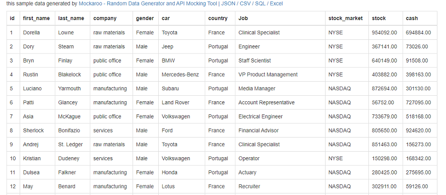

# ToPivotTable

IEnumerable<T>をPivotTable風に変換するライブラリ。




↓


mvc5で使えるようヘルパを同梱してる。

## つかいかた

```cs
    public class MockData {
        public int id { get; set; }
        public string first_name { get; set; }
        public string last_name { get; set; }
        public string company { get; set; }
        public string gender { get; set; }
        public string car { get; set; }
        public string country { get; set; }
        public string Job { get; set; }
        public string stock_market { get; set; }
        public decimal stock { get; set; }
        public decimal cash { get; set; }
    }
```

というモデルに対して

```cs
    var pivot = SampleDB.Data.ToPivotTable(
                    PivotColumn<MockData>.Build("country", "gender"), // 行に展開される軸
                    PivotColumn<MockData>.Build("stock_market"), // 列に展開される軸
                    PivotMeasure<MockData>.Build("stock") // 集計する値
                );
```

と `ToPivotTable()` とするだけでピボットが作成できる。

MVC5を使用している場合はビューの`cshtml`内で

```cs
@Html.RenderPivotTable(Model.pivot, Model.Option)
```

と、するだけでいい感じに描画してくれる。

## 集計方法のカスタマイズ

### 集計項目を増やす
複数項目で集計する場合は

```cs
    PivotMeasure<MockData>.Build("stock","cash") 
```
と列挙する。

### 平均や個数など合計以外の集計を行う

```cs
model.pivot = SampleDB.Data.ToPivotTable(
                    PivotColumn<MockData>.Build("country", "gender"),
                    PivotColumn<MockData>.Build("stock_market"),
                    new List<PivotMeasure<MockData>>() {
                        PivotMeasure<MockData>.Count("Count",(t)=>t.stock),
                        PivotMeasure<MockData>.Sum("Sum",(t)=>t.stock),
                        PivotMeasure<MockData>.Average("Avg",(t)=>t.stock),
                        PivotMeasure<MockData>.Min("Min",(t)=>t.stock),
                        PivotMeasure<MockData>.Max("Max",(t)=>t.stock),
                    }
                );
```

### 計算結果を集計軸に使用する

```cs
model.pivot = DB.ToPivotTable(
                    new List<PivotColumn<MockData>>() {
                        new PivotColumn<MockData>("initial",(t)=>t.car.Substring(0,1),(t)=>t.car.Substring(0,1)){
                            Order=PivotOrder.Descending,
                        },
                        new PivotColumn<MockData>("car"),
                    },
                    new List<PivotColumn<MockData>>() {
                        new PivotColumn<MockData>("category",(t)=>t.Job.Split(' ').First(),(t)=>t.Job.Split(' ').First()),
                        new PivotColumn<MockData>("Job",(t)=>string.Join(" ",t.Job.Split(' ').Skip(1))),
                    },
                    new List<PivotMeasure<MockData>>() {
                        PivotMeasure<MockData>.Average("Avg.Cash",(t)=>t.cash),
                    }
                );
```

とする。

```cs
public PivotColumn(string PropertyName, Func<T, string> titleGetter = null, Func<T, dynamic> valueGetter = null) 
```

|パラメータ|設定値|
|---|---|
|PropertyName|プロパティ名、valueGetterが設定されていない場合は`T.PropertyName`を値として参照する。|
|titleGetter|列や行のタイトルとして表示される値を取得する。未設定の場合は値の`ToString()`が使用される。|
|valueGetter|列や行の集計対象の値を取得する。|

### 行列を入れ替える

```cs
    var pivot = SampleDB.Data.ToPivotTable(
                    PivotColumn<MockData>.Build("country", "gender"), // 行に展開される軸
                    PivotColumn<MockData>.Build("stock_market"), // 列に展開される軸
                    PivotMeasure<MockData>.Build("stock") // 集計する値
                ).flip();
```

`flip()`を使う

### 小計や合計を表示する。

```cs
    model.Option.Header[HeaderType.Row].RenderTotal = true;
    model.Option.HeaderCellOption[model.pivot.ColumnByName("country")].RenderTotal = true;
```

`PivotTableRenderOption.Header`や`PivotTableRenderOption.HeaderCellOption`の`RenderTotal`をtrueに設定する。

[PivotTableRenderOption](ToPivotTable.MVC5/PivotTableRenderOption.cs)

## デザインのカスタマイズ

[Site.less](Samples/ASP.Net-Sample/Content/Site.less)
```less
table.pivot {
    display: table;
    border-collapse: separate;
    border-spacing: 0px;
    @ColHeaderBaseColor: #1E5799;
    @RowHeaderBaseColor: #608060;
    @BorderColor: #ddd;
    @measureTitleColor: #b0d0d0;

    .number {
        text-align: right;
    }

    .rowtitle {
        .gradientCell(darken(@RowHeaderBaseColor,10%));
    }

    th, td {
        padding: 5px;
        white-space: nowrap;
    }

    .cornerHeader {
        background-color: white;
    }

    .gradientCell(@CellBaseColor) {
        color: white;
        background: @CellBaseColor;
        background: -moz-linear-gradient(top, @CellBaseColor 0%, darken(@CellBaseColor,10%) 60%, lighten(@CellBaseColor,10%) 100%); /* FF3.6-15 */
        background: -webkit-linear-gradient(top, @CellBaseColor 0%, darken(@CellBaseColor,10%) 60%, lighten(@CellBaseColor,10%) 100%); /* Chrome10-25,Safari5.1-6 */
        background: linear-gradient(to bottom, @CellBaseColor 0%, darken(@CellBaseColor,10%) 60%, lighten(@CellBaseColor,10%) 100%); /* W3C, IE10+, FF16+, Chrome26+, Opera12+, Safari7+ */
    }

    .headerRowMixin(@ColHeaderBGColor: @ColHeaderBaseColor) {
        th {
            color: white;
            border-right: #ccc 1px solid;
            border-bottom: #ccc 1px solid;
        }

        .coltitle {
            background-color: darken(@ColHeaderBGColor,5%);
        }

        .cell {
            .gradientCell(@ColHeaderBGColor);
        }

        .colGrandTotal {
            .gradientCell(darken(@ColHeaderBGColor,10%));
        }
    }

    tr.headerRow:nth-child(1) {
        .headerRowMixin(@ColHeaderBaseColor)
    }

    tr.headerRow:nth-child(2) {
        .headerRowMixin(lighten(@ColHeaderBaseColor,10%));
    }

    tr.headerRow:nth-child(3) {
        .headerRowMixin(lighten(@ColHeaderBaseColor,20%));
    }

    tr.headerRow:nth-child(4) {
        .headerRowMixin(lighten(@ColHeaderBaseColor,30%));
    }

    .measureTitle {
        .gradientCell(@measureTitleColor);
        white-space: nowrap;
    }

    tr.dataRow {
        td, th {
            border-bottom: @BorderColor 1px solid;
        }

        &:hover {
            background-color: #eee;
        }

        th.cell {
            vertical-align: top;
            border-right: #ccc 1px solid;
            border-bottom: #ccc 1px solid;

            &.ch-0 {
                .gradientCell(lighten(@RowHeaderBaseColor,10%));
            }

            &.ch-1 {
                .gradientCell(lighten(@RowHeaderBaseColor,20%));
            }

            &.ch-2 {
                .gradientCell(lighten(@RowHeaderBaseColor,30%));
            }

            &.GrandTotal {
                .gradientCell(darken(@RowHeaderBaseColor,10%));
            }
        }
    }
}
```

## ヘッダの固定

```css
div.pivot-host {
    height: 800px;
    width: 100%;
    overflow: auto;
}
```

```js
$(function () {
    let table = $("table.pivot");
    let fixedRow = table.data("hrows");
    let fixedCol = table.data("hcols");
    let top = 0;
    for (let i = 0; i < fixedRow; i++) {
        let cell = $("table.pivot>thead>tr.headerRow>.cell.rh-" + i);
        if (cell.length === 0) break;
        $("table.pivot>thead>tr.headerRow>.rh-" + i).css({
            "position": "sticky",
            "top": top,
            "z-index": 1
        });
        top += cell.outerHeight();
    }
    $("table.pivot>thead>tr.headerRow>.measureTitle").css({
        "position": "sticky",
        "top": top,
        "z-index": 1
    });
    $("table.pivot>thead>tr.headerRow>.rowtitle").css({
        "position": "sticky",
        "top": top,
        "z-index": 1
    });

    let left = 0;
    for (let i = 0; i < fixedCol; i++) {
        let cell = $("table.pivot tr.dataRow .ch-" + i);
        if (cell.length === 0) break;
        $("table.pivot .ch-" + i).css({
            "position": "sticky",
            "left": left,
            "z-index": 2
        });
        left += cell.outerWidth();
    }
    $("table.pivot tr.dataRow .measureTitle").css({
        "position": "sticky",
        "left": left,
        "z-index": 2
    });
    $(".cornerHeader").css("z-index", 3);
    $(".coltitle ,.rowtitle").css("z-index", 3);

});
```

